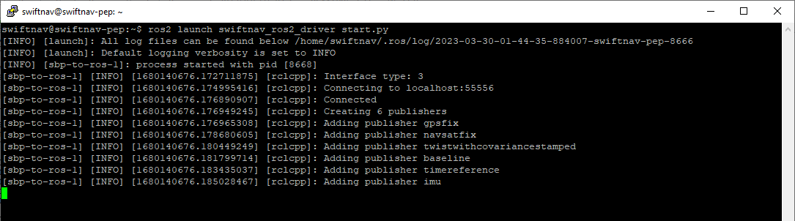
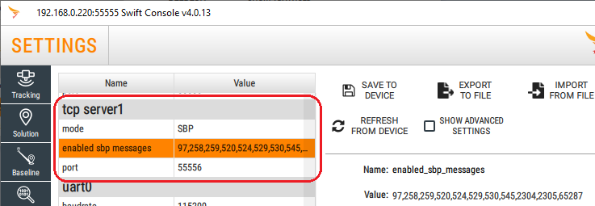

# **swiftnav-ros2**
ROS 2 driver for Swift Navigation's GNSS/INS receivers and Starling Positioning Engine software.

# **Table of Contents**
- [Features](#features)
- [ROS Topics](#ros-topics)
- [Building Driver](#building-driver)
- [Launching Driver](#launching-driver)
- [Driver Configuration](#driver-configuration)
- [GNSS Receiver Configuration](#gnss-receiver-configuration)
- [Technical Support](#technical-support)

# Features
- Designed for ROS 2 Humble but also works with ROS 2 Foxy and Galactic
- Developed and tested on Ubuntu 22.04 (ROS 2 Humble) and Ubuntu 20.04 (ROS 2 Foxy/Galactic) platforms
- Supports Swift Navigation receivers and Starling Positioning Engine in Swift Binary Protocol (SBP)
- TCP Client and Serial communication interfaces
- SBP file playback
- SBP data logging
- Publishes ROS 2 standard and Swift Navigation proprietary topics
- Configurable time stamping
- Written in C++

# ROS Topics
The driver receives Swift binary (SBP) messages (see [GNSS Receiver Configuration](#gnss-receiver-configuration) for setting up the receiver) and publishes the following ROS topics:
 - [`GpsFix`](#gpsfix)
 - [`NavSatFix`](#navsatfix)
 - [`TwistWithCovarianceStamped`](#twistwithcovariancestamped)
 - [`Baseline` *(proprietary)*](#baseline)
 - [`TimeReference`](#timereference)
 - [`Imu`](#imu)

Topic publication details are described below.

## GpsFix

`gps_msgs/msg/GPSFix`

### SBP Messages Used
- `UTC TIME` (ID: 259, *required/optional*) - UTC time of reported position. Required when `timestamp_source_gnss` is `True`.
- `GPS TIME` (ID: 258, *required*) - GPS time of reported position.
- `POS LLH COV` (ID: 529, *required*) - GNSS position with covariance.
- `VEL NED COV` (ID: 530, *required*) - GNSS velocity with covariance.
- `ORIENT EULER` (ID: 545, *optional*) - GNSS/INS orientation with estimated errors.
- `DOPS` (ID: 520, *optional*) - GNSS DOP (Dilution Of Precision) data.

### Topic Publication
Topic publication depends on `timestamp_source_gnss` setting flag in the configuration file:  
- `True`: The topic is published upon receiving SBP `UTC TIME`, `GPS TIME`, `POS LLH COV`, `VEL NED COV` and, if present, `ORIENT EULER` messages with the same TOW. The topic timestamp contains the UTC time reported by the GNSS receiver. If the UTC time is not available the current platform time is reported.
- `False`: The topic is published upon receiving SBP `GPS TIME`, `POS LLH COV`, `VEL NED COV` and, if present, `ORIENT EULER` messages with the same TOW. The topic timestamp contains the current platform time.

### Topic Fields
| ROS2 Message Field | SBP Message Data Source | Notes |
| :--- | :---: | :--- |
|`header.stamp`|`UTC TIME`|See Topic Publication for time stamping details|
|`header.frame_id`|--|Text from `frame_name` field in the `settings.yaml` configuration file |
|`status.satellites_used`|`POS LLH COV`||
|`status.satellite_used_prn[]`|--|Not populated|
|`status.satellites_visible`<br>`status.satellite_visible_prn[]`<br>`status.satellite_visible_z[]`<br>`status.satellite_visible_azimuth[]`<br>`status.satellite_visible_snr[]`|--|Not populated|
|`status.status`|`POS LLH COV`|Dead Reckoning (DR) position is reported as `STATUS_FIX` (0)|
|`status.motion_source`|`VEL NED COV`||
|`status.orientation_source`|`POS LLH COV`||
|`status.position_source`|`POS LLH COV`||
|`latitude`<br>`longitude`<br>`altitude`<br>|`POS LLH COV`|Zeros when the fix is invalid. If position is valid altitude is always present (i.e. never NaN).|
|`track`|`VEL NED COV`<br>or<br>`ORIENT EULER`|If `ORIENT EULER` message is present and `yaw` data valid, reports `yaw`. If `yaw` is invalid reports computed Course Over Ground from `VEL NED COV` message. `VEL NED COV` updates `track` only if horizontal speed is above the `track_update_min_speed_mps` setting in the settings file. When the track becomes invalid the last valid track is reported. |
|`speed`|`POS LLH COV`|Computed horizontal (2D) speed|
|`climb`|`POS LLH COV`||
|`pitch`<br>`roll`|`ORIENT EULER`||
|`dip`|--|Not populated|
|`time`|`GPS TIME`|GPS time in seconds since 1980-01-06 |
|`gdop`<br>`pdop`<br>`hdop`<br>`vdop`<br>`tdop`|`DOPS`|DOPs are published if the most recent SBP `DOPS` message is not older than 2 seconds.|
|`err`<br>`err_horz`<br>`err_vert`|`POS LLH COV`||
|`err_track`|`VEL NED COV`<br>or<br>`ORIENT EULER`||
|`err_speed`<br>`err_climb`|`VEL NED COV`||
|`err_time`|--|Not populated|
|`err_pitch`<br>`err_roll`|`ORIENT EULER`||
|`err_dip`|--|Not populated|
|`position_covariance`<br>`position_covariance_type`|`POS LLH COV`|Covariance, if valid, is always `TYPE_KNOWN` (full matrix).|


## NavSatFix
 
`sensor_msgs/msg/NavSatFix`

### SBP Messages Used
- `UTC TIME` (ID: 259, *required/optional*) - UTC time of reported position. Required when `timestamp_source_gnss` is `True`.
- `POS LLH COV` (ID: 529, *required*) - GNSS position data with covariance.
- `MEASUREMENT STATE` (ID: 97, *optional*) - GNSS constellations data.

### Topic Publication
Topic publication depends on `timestamp_source_gnss` setting flag in the configuration file:  
- `True`: the topic is published upon receiving SBP `UTC TIME` and `POS LLH COV` messages with the same TOW. The topic timestamp contains the UTC time reported by the GNSS receiver. If the UTC time is not available the current platform time is reported.
- `False`: the topic is published upon receiving SBP `POS LLH COV` message. The topic timestamp contains the current platform time.

### Topic Fields
| ROS2 Message Field | SBP Message Data Source | Notes |
| :--- | :---: | :--- |
|`header.stamp`|`UTC TIME`|See Topic Publication for time stamping details|
|`header.frame_id`|--|Text from `frame_name` field in the `settings.yaml` configuration file |
|`status.status`|`POS LLH COV`|Dead Reckoning (DR) position is reported as `STATUS_FIX` (0)|
|`status.service`|`MEASUREMENT STATE`|GNSS constellations from the last `MEASUREMENT STATE` message. Reports zero when message is not present.|
|`latitude`<br>`longitude`<br>`altitude`<br>`position_covariance`<br>`position_covariance_type`|`POS LLH COV`|Zeros when the fix is invalid. If position is valid altitude is always present (i.e. never NaN). Covariance, if valid, is always `TYPE_KNOWN` (full matrix).|

 
 ## TwistWithCovarianceStamped
 
`geometry_msgs/msg/TwistWithCovarianceStamped`

### SBP Messages Used
- `UTC TIME` (ID: 259, *required/optional*) - UTC time of reported velocity. Required when `timestamp_source_gnss` is `True`.
- `VEL NED COV` (ID: 530, *required*) - GNSS velocity data with covariance.

### Topic Publication
Topic publication depends on `timestamp_source_gnss` setting flag in the configuration file:  
- `True`: the topic is published upon receiving SBP `UTC TIME` and `VEL NED COV` messages with the same TOW. The topic timestamp contains the UTC time reported by the GNSS receiver. If the UTC time is not available the current platform time is reported.
- `False`: the topic is published upon receiving SBP `VEL NED COV` message. The topic timestamp contains the current platform time.

### Topic Fields
| ROS2 Message Field | SBP Message Data Source | Notes |
| :--- | :---: | :--- |
|`header.stamp`|`UTC TIME`|See Topic Publication for time stamping details|
|`header.frame_id`|--|Text from `frame_name` field in the `settings.yaml` configuration file |
|`linear.x`<br>`linear.y`<br>`linear.z`|`VEL NED COV`|Conversion from NED frame:<br>`x` = `east`<br>`y` = `north`<br>`z` = `-down`<br>Zeros when velocity is invalid.|
|`angular.x`<br>`angular.y`<br>`angular.z`|--|Not populated. Always zero.|
|`covariance`|`VEL NED COV`|If velocity is valid, linear velocity covariance is full matrix. `covariance[0]` is set to -1 when linear velocity is invalid. `covariance[21]` is always -1.|

 
## Baseline

`swiftnav-ros2/msg/Baseline`   *Proprietary message*

### SBP Messages Used
- `UTC TIME` (ID: 259, *required/optional*) - UTC time of reported baseline. Required when `timestamp_source_gnss` is `True`.
- `BASELINE NED` (ID: 524, *required*) - RTK baseline NED vector.

### Topic Publication
Topic publication depends on `timestamp_source_gnss` setting flag in the configuration file:  
- `True`: the topic is published upon receiving SBP `UTC TIME` and `BASELINE NED` messages with the same TOW. The topic timestamp contains the UTC time reported by the GNSS receiver. If the UTC time is not available the current platform time is reported.
- `False`: the topic is published upon receiving SBP `BASELINE NED` message. The topic timestamp contains the current platform time.

### Topic Fields
| ROS2 Message Field | SBP Message Data Source | Notes |
| :--- | :---: | :--- |
|`header.stamp`|`UTC TIME`|See Topic Publication for time stamping details|
|`header.frame_id`|--|Text from `frame_name` field in the `settings.yaml` configuration file |
|`mode`|`BASELINE NED`|Solution mode:<br>`0` - Invalid<br>`3` - Float RTK<br>`4` - Fixed RTK|
|`satellites_used`|`BASELINE NED`|Number of satellites used in the solution|
|`baseline_n_m`<br>`baseline_e_m`<br>`baseline_d_m`|`BASELINE NED`|Baseline NED vectors in [m]. Zeros when invalid. Vectors origin is at the base location.|
|`baseline_err_h_m`|`BASELINE NED`|Estimated (95%) horizontal error of baseline in [m]. Zero when invalid.|
|`baseline_err_v_m`|`BASELINE NED`|Estimated (95%) vertical error of baseline in [m]. Zero when invalid.|
|`baseline_length_m`|`BASELINE NED`|Computed 3D baseline length. Zero when invalid.|
|`baseline_length_h_m`|`BASELINE NED`|Computed horizontal baseline length. Zero when invalid.|
|`baseline_orientation_valid`|`BASELINE NED`|`True` when baseline orientation (dir and dip) is valid. `False` when invalid.|
|`baseline_dir_deg`|`BASELINE NED`|Computed horizontal angle (bearing/heading) from base to rover in [degrees]. Valid only in RTK fixed mode. Range [0..360) from true north. Zero when invalid.|
|`baseline_dir_err_deg`|`BASELINE NED`|Estimated (95%) error of `baseline_dir_deg` in [degrees]. Range [0..180]. Zero when invalid.|
|`baseline_dip_deg`|`BASELINE NED`|Computed vertical angle from base to rover in [degrees]. Valid only in RTK fixed mode. Range [-90..90]. Zero when invalid.|
|`baseline_dip_err_deg`|`BASELINE NED`|Estimated (95%) error of `baseline_dip_deg` in [degrees]. Range [0..90]. Zero when invalid.|


## TimeReference
 
`sensor_msgs/msg/TimeReference`

### SBP Messages Used
- `UTC TIME` (ID: 259, *required/optional*) - UTC time. Required when `timestamp_source_gnss` is `True`.
- `GPS TIME` (ID: 258, *required*) - GPS time.

### Topic Publication
Topic publication depends on `timestamp_source_gnss` setting flag in the configuration file:  
- `True`: the topic is published upon receiving SBP `UTC TIME` and `GPS TIME` messages with the same TOW. The topic timestamp contains the UTC time reported by the GNSS receiver. If the UTC time is not available the current platform time is reported.
- `False`: the topic is published upon receiving SBP `GPS TIME` message. The topic timestamp contains the current platform time.

### Topic Fields
| ROS2 Message Field | SBP Message Data Source | Notes |
| :--- | :---: | :--- |
|`header.stamp`|`UTC TIME`|See Topic Publication for time stamping details|
|`header.frame_id`|--|Not used|
|`time_ref`|`GPS TIME`|GPS time in seconds since 1980-01-06. `sec` value is set to -1 if the GPS time is not available.|
|`source`|--|Text from `frame_name` field in the `settings.yaml` configuration file |
 
 
## Imu

`sensor_msgs/msg/Imu`

### SBP Messages Used
- `UTC TIME` (ID: 259, *required/optional*) - UTC time. Required when `timestamp_source_gnss` is `True`.
- `GPS TIME` (ID: 258, *required*) - GPS time
- `GNSS TIME OFFSET` (ID: 65287, *required/optional*) - Offset of the IMU local time with respect to GNSS time. Required when the original IMU time source is a local time.
- `IMU AUX` (ID: 2305, *required*) - Auxiliary IMU data
- `IMU RAW` (ID: 2304, *required*) - Raw IMU data

### Topic Publication
Topic is published upon receiving `IMU RAW` SBP message.
Time stamp depends on `timestamp_source_gnss` setting flag in the configuration file:  
- `True`: The topic timestamp contains the UTC time of the measurement computed from `UTC TIME`, `GPS TIME`, `GNSS TIME OFFSET` and `IMU RAW` SBP messages depending on original IMU time stamping source. If the UTC time is not available the current platform time is reported.
- `False`: The topic timestamp contains the current platform time.

### Topic Fields
| ROS2 Message Field | SBP Message Data Source | Notes |
| :--- | :---: | :--- |
|`header.stamp`|`UTC TIME`<br>`GPS TIME`<br>`GNSS TIME OFFSET`|See Topic Publication for time stamping details|
|`header.frame_id`|--|Text from `frame_name` field in the `settings.yaml` configuration file |
|`orientation`<br>`orientation_covariance`|--|Not populated. Always zero. `orientation_covariance[0]` is always -1.|
|`angular_velocity`|`IMU RAW`<br>`IMU AUX`|Reported in sensor frame. Zeros when invalid.|
|`angular_velocity_covariance`|--|Not populated. `angular_velocity_covariance[0]` is set to -1 when angular velocity is not valid or when the time stamping source has changed|
|`linear_acceleration`|`IMU RAW`<br>`IMU AUX`|Reported in sensor frame. Zeros when invalid.|
|`linear_acceleration_covariance`|--|Not populated. `linear_acceleration_covariance[0]` is set to -1 when linear acceleration is not valid or when the time stamping source has changed |


# Building Driver

[Click here if building driver in a docker](docs/build-in-docker.md)

### Dependencies:
- `libsbp` - Swift Binary Protocol library
- `libserialport` - Serial Port communication library


## Step 1 (Install ROS 2 Humble):
 Follow [instructions to install ROS 2 Humble](https://docs.ros.org/en/humble/Installation.html)

## Step 2 (Install libspb):
  In any directory you wish, clone libsp v4.11.0, init the repo, make the lib and install it
    
  ```
    git clone https://github.com/swift-nav/libsbp.git
    cd libsbp
    git checkout v4.11.0
    cd c
    git submodule update --init --recursive
    mkdir build
    cd build
    cmake DCMAKE_CXX_STANDARD=17 -DCMAKE_CXX_STANDARD_REQUIRED=ON -DCMAKE_CXX_EXTENSIONS=OFF ../ 
    make
    sudo make install
  ```

## Step 3 (Download Driver Code)
  Navigate to workspace directory (e.g.: `~/workspace`) and download driver source files
    
  ```
    cd ~/workspace
    mkdir src
    cd src
    git clone https://github.com/swift-nav/swiftnav-ros2.git
  ```

## Step 4 (Install Dependencies)
  Initialize environment and install dependencies
  
  ```
    cd ~/workspace
    source /opt/ros/humble/setup.bash
    sudo apt-get update
    sudo apt-get install libserialport-dev
    rosdep install --from-paths src --ignore-src -r -y
  ```

## Step 5 (Edit Configuration)
  Edit configuration file as required. See [ROS 2 driver configuration](#driver-configuration) for setting details.
  
  ```
    nano ~/workspace/src/swiftnav-ros2/config/settings.yaml
  ```

## Step 6 (Build)
  Initialize environment and build the driver
  
  ```
    cd ~/workspace
    source /opt/ros/humble/setup.bash
    colcon build
  ```

# Launching Driver

## Launching
  Source installed driver and start it
  
  ```
    source install/setup.bash
    ros2 launch swiftnav_ros2_driver start.py
  ```




## Viewing Topics
  Swift specific SBP messages are not a part of the ROS 2 standard library, therefore the following command must be run in any terminal that is used for interfacing with this driver (e.g.: echoing the `baseline` message in a new terminal)
  
  ```
    source install/setup.bash
    ros2 topic echo /baseline
  ```

## Changing Configuration
  Changing the configuration file can be done in the driver source (`config/settings.yaml`), but the driver will need to be rebuilt. Alternatively, the configuration file can be changed in the installed directory:
  
  ```
    nano install/swiftnav_ros2_driver/share/swiftnav_ros2_driver/config/settings.yaml
  ```


# Driver Configuration
The driver configuration is stored in the `config/settings.yaml` file. The following settings are available:

| Parameter | Accepted Values | Description |
| :--- | :--- | :--- |
| `interface` | `1`, `2`, `3` | SwiftNav GNSS receiver communication interface:<br>`1` - TCP Client<br>`2` - Serial port<br>`3` - File (playback) |
| `host_ip`| E.g.: `192.168.0.222` | IP address of the GNSS receiver. Only used if `interface` is `1`. |
| `host_port`| E.g.: `55556` | TCP port used. Only used if `interface` is `1`. |
| `read_timeout`<br>`write_timeout` | E.g.: `10000` | A timeout for read/write operations in milliseconds. Used for `interface` `1` and `2`. |
| `device_name` | E.g.: `/dev/ttyS0` (Linux), `COM1` (Windows) | Serial device name. Only used if `interface` is `2`. |
| `connection_str` | E.g.: `115200\|N\|8\|1\|N` (See [Connection String Description](#connection-string-description)) | A connection string that describes the parameters needed for the serial communication. Only used if `interface` is `2`. |
| `sbp_file` | E.g.: `/logs/sbp-file.sbp` | SBP file name for playback. Absolute path is required. Only used if `interface` is `3`. Playback is done at file reading rate, not a real-time. |
| `frame_name`|string|ROS topics frame name |
| `timestamp_source_gnss`|`True`, `False`|Topic publication header time stamp source. `True`: use GNSS receiver reported time, `False`: use current platfrom time. |
| `baseline_dir_offset_deg`| -180.0 .. 180.0 | RTK Baseline direction offset in [deg]. Floating point value is required. |
| `baseline_dip_offset_deg`| -90.0 .. 90.0 | RTK Baseline dip offset in [deg]. Floating point value is required. |
| `track_update_min_speed_mps`| E.g.: `1.0`| Mininal horizontal speed for `track` updates from SBP message `VEL NED COV` in [m/s]. `track` and `err_track` outputs are 'frozen' below this threshold. Floating point value is required. |
| `enabled_publishers[]`|`gpsfix`<br>`navsatfix`<br>`twistwithcovariancestamped`<br>`baseline`<br>`timereference`<br>`imu`| List of enabled publishers. Delete (comment out) the line to disable publisher.
| log_sbp_messages | `True`, `False` | Enable/disable SBP raw data recording. |
| log_sbp_filepath | E.g.: `/logs/sbp-files/` | Absolute path (without a file name) for SBP log file location. File name is created automatically with the current date and time, e.g.: `swiftnav-20230404-160720.sbp`. |


## Connection String Description
The connection string for the serial interface has the form:
`BAUD RATE`&#124;`PARITY`&#124;`DATA BITS`&#124;`STOP BITS`&#124;`FLOW CONTROL`

### Baud Rates
`1200`, `2400`, `4800`, `9600`, `19200`, `38400`, `57600`, `115200`, `230400`, `460800`, `921600`.

### Parity
| Value | Description |
|:--- | :--- |
| `N` | No parity |
| `E` | Even parity |
| `O` | Odd parity |
| `M` | Mark parity *(Not available in some Linux distributions)* |
| `S` | Space parity *(Not available in some Linux distributions)* |

### Data Bits
`7` or `8`

### Stop Bits
`1` or `2`

### Flow Control
| Value | Description |
|:--- | :--- |
| `N` | No flow control |
| `X` | Xon/Xoff |
| `R` | RTS/CTS |
| `D` | DTR/DSR |


# GNSS Receiver Configuration

The ROS 2 driver works with Swift Navigation receivers and Starling Position Engine software using data in SBP protocol. Refer to the receiver-specific manual to configure your receiver:

- [Piksi Multi](https://support.swiftnav.com/support/solutions/folders/44001200455)
- [Duro](https://support.swiftnav.com/support/solutions/folders/44001200456)
- [PGM EVK](https://support.swiftnav.com/support/solutions/articles/44002129828-pgm-evaluation-kit)
- [Starling Positioning Engine](https://support.swiftnav.com/support/solutions/folders/44001223202)

It's recommended to dedicate one output port for ROS and output on that port only messages required by the driver. This will minimize the latency and jitter of the incoming messages, and decrease CPU load. 

The driver uses the following SBP messages:

| Message Name | Message ID (decimal) | Description |
| :--- | :---: | :--- |
| `MEASUREMENT STATE` | 97 | Satellite tracking data |
| `GPS TIME` | 258 | GPS time |
| `UTC TIME` | 259 | UTC time |
| `DOPS` | 520 | Dillution Of Precision |
| `BASELINE NED` | 524 | Baseline vectors in NED frame |
| `POS LLH COV` | 529 | Position (latitude, longitude, altitude) with covariance |
| `VEL NED COV` | 530 | Velocity vectors in NED frame with covariance |
| `ORIENT EULER` | 545 | Orientation (roll, pitch, yaw)<br>*Note: message is available only in products with inertial fusion enabled* |
| `IMU RAW` | 2304 | Raw IMU data |
| `IMU AUX` | 2305 | IMU temperature and senor ranges |
| `GNSS TIME OFFSET` | 65287 | Offset of the local time with respect to GNSS time |

Download [Swift Binary Protocol Specification](https://support.swiftnav.com/support/solutions/articles/44001850782-swift-binary-protocol)


### Piksi Multi / Duro Configuration Example

Piksi Multi and Duro configuration can be changed using Swift Console program. `TCP Server 1` settings example:



*Note: Click SAVE TO DEVICE button to memorize settings over the power cycle.*


### Starling Configuration Example
  
Starling configuration is saved in the yaml configuration file. `TCP server` output example:
  ```
  ...
    outputs:
      - name: sbp-ros2
        protocol: sbp
        type: tcp-server
        port: 55556
        max-conns: 4
        sbp:
          enabled-messages: [ 97,258,259,520,524,529,530,545,2304,2305,65287 ]
  ...
  ```


# Technical Support

Support requests can be made by filling the Support Request Form on the [Swift Navigation Support page](https://support.swiftnav.com/) (Support Request Form button is at the bottom of the page). A simple login is required to confirm your email address.
