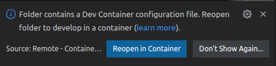
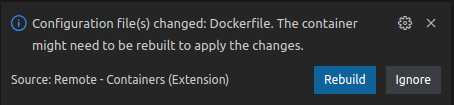

# **swiftnav-ros2**
Swift Navigation's ROS2 SBP Driver for Piksi multi/Duro, PGM, STEP and EVK

# **Table of contents**
- [Setting the environment for Visual Studio Code](#setting-the-environment-for-visual-Studio-Code)
    - [Setup a Docker container that works with VSCode](#docker-container-for-vscode)
    - [Cloning the driver's repository](#cloning-the-drivers-repository)
- [Building the ROS2 driver](#building-the-ros2-driver)
- [ROS2 driver configuration](#ros2-driver-configuration)
- [Adding a new SBP message to ROS2 topic translation](#adding-a-new-sbp-message-to-ros2-topic-translation)
    - [Step 1 (Add a new class to publishers)](#step-1-add-a-new-class-to-publishers)

- [Adding a new ROS2 topic to SBP message transaltion](#adding-a-new-ros2-topic-to-sbp-message-transaltion)


# **Setting the environment for Visual Studio Code**
Let's start creating the folder for the project:

```
mkdir swift
cd swift
```

## Setup a Docker container that works with VSCode
Once we have the folder for our project, we need to add a special folder in order for VSCode to automaticaly connect and use the docker conatiner.
```
mkdir .devcontainer
cd .devcontainer
```
Here we should create a couple of files. First the Dockerfile:
```
FROM osrf/ros:humble-desktop

ARG DEBIAN_FRONTEND=noninteractive

ENV CC=gcc-11
ENV CXX=g++-11

ARG UID=1000

RUN apt-get update && apt-get install --yes \
    build-essential \
    pkg-config \
    cmake \
    doxygen \
    check \
    clang-format-13 \
    clang-tidy \
    libserialport-dev \
    python3-pip

# Add a "dockerdev" user with sudo capabilities
# 1000 is the first user ID issued on Ubuntu; might
# be different for Mac users. Might need to add more.
RUN \
     useradd -u ${UID} -ms /bin/bash -G sudo dockerdev \
  && echo '%sudo ALL=(ALL) NOPASSWD:ALL' >>/etc/sudoers

WORKDIR /home/dockerdev
RUN chown -R dockerdev:dockerdev /home/dockerdev
USER dockerdev

RUN git clone https://github.com/swift-nav/libsbp.git
WORKDIR /home/dockerdev/libsbp/c
RUN git submodule update --init
RUN mkdir build &&  \
    cd build && \
    cmake DCMAKE_CXX_STANDARD=17 -DCMAKE_CXX_STANDARD_REQUIRED=ON -DCMAKE_CXX_EXTENSIONS=OFF ../ && \
    make && \
    sudo make install

WORKDIR /workspaces/swift
```
and then, the file named "devcontainer.json"; this file is the one that VSCode will use to do the magic

```
{
    "context": "../",
    "name": "swift-driver",
    "dockerFile": "Dockerfile",
    "runArgs": [
        "--security-opt", "seccomp=unconfined",
        "--name=swift-driver",
        "--volume=/dev:/dev",
        "--privileged",
        "--network=host",
        "--gpus", "all",
        "-e", "DISPLAY",
        "-e", "QT_GRAPHICSSYSTEM=native",
        "-e", "QT_X11_NO_MITSHM=1",
        "-v", "/tmp/.X11-unix:/tmp/.X11-unix"
    ],
    "extensions": [
		"ms-python.python",
		"ms-vscode.cpptools",
		"ms-iot.vscode-ros",
		"xaver.clang-format",
		"twxs.cmake",
		"ms-vscode.cmake-tools",
		"cschlosser.doxdocgen",
		"eamodio.gitlens",
		"ms-python.vscode-pylance",
		"himanoa.Python-autopep8",
		"shardulm94.trailing-spaces",
        "notskm.clang-tidy"
	]
}
```
Now we're ready. Let's go back to out project dir and start VSCode

```
cd ..
code .
```
Visual studio code should open and present you the following dialog:



Click "Reopen in container button" and then you will be asked to rebuild the container:



Click the "Rebuild" button and, after a while, you will be ready.

## Cloning the driver's repository
Open a terminal and enter an interactive docker session:

```
docker exec -it swift-driver bash
```
and there clone the repository

```
cd /workspaces/swift
git clone https://github.com/swift-nav/swiftnav-ros2.git
```


# Building the ROS2 driver
In the VSCode terminal execute:
```
colcon build
```
and that's it, after a few seconds you will have the driver built.

# ROS2 driver configuration
The driver offers the following configuration options:

| Parameter | Accepted values | Description |
| :--- | :--- | :--- |
| interface | See [Interface values table](#interface-values-table) | Interface from which the driver will communicate with the device |
| sbp_file | Example: /logs/sbp_example_file.sbp | Path to the SBP file (Only used if interface is 1)|
| device_name | Example: COM1 (Windows), /dev/ttyS0 (Linux) | A valid serial device name for the OS (Only used if interface is 2)|
| connection_str | Example: "115200&#124;N&#124;8&#124;1&#124;N" (See [Connection string description](#connection-string-description)) | A connection string that describes the parameters needed for the serial communication (Only used if interface is 2)|
| host_ip | Example: 192.168.1.45 | A valid IP address (Only used if interface is 3)|
| host_port | Example: 8082 | A valid TCP port value (Only used if interface is 3)|
| timeout | Example: 10000 | A timeout for reading operations in milliseconds (used for interfaces 2 and 3) |
| navsatfix | True: Publish, False: Don't publish | Flag to enable/disable the publication of the navsatfix topic (std_msgs::NavSatFix)|
| timereference | True: Publish, False: Don't publish | Flag to enable/disable the publication of the timereference topic (std_msgs::TimeReference)|
| log_sbp_messages | True: Log messages, False: Don't Log messages | Dump all the SBP received messages into an SBP file |
| log_sbp_filepath | Example: /logs/sbp_files/ | Path (without file name) in which the sbp file for log should be created |


### Interface values table
| Value | Description |
| :--- | :--- |
| 0 | Invalid |
| 1 | Data from file |
| 2 | Serial port |
| 3 | TCP |

## Connection string description
The connection string for the serial interface has the form:
BAUD RATE&#124;PARITY&#124;DATA BITS&#124;STOP BITS&#124;FLOW CONTROL

### Available baud rates
1200, 2400, 4800, 9600, 19200, 38400, 57600, 115200, 230400, 460800. 921600.
Please remember that this baud rates are subject of your hardware and OS capabilities.

### Parities table
| Value | Description |
|:--- | :--- |
| N | No parity |
| E | Even parity |
| O | Odd parity |
| M | Mark parity (Not available in some linux distributions) |
| S | Space parity (Not available in some linux distributions) |

### Data bits
Usually 7 or 8

### Stop Bits
1 or 2

### Flow control table
| Value | Description |
|:--- | :--- |
| N | No flow control |
| X | Xon/Xoff flow control |
| R | RTS/CTS flow control |
| D | DTR/DSR flow control |


# Adding a new SBP message to ROS2 topic translation
In order to add a new SBP to ROS2 translation unit, you should (let's assume that you want to translate MSG_VEL_ECEF_GNSS to geometry_msgs/Pose2D):

## Step 1 (Add a new class to publishers)
```
// Header file (pose_2d_publisher.h)
class Pose2DPublisher : public SBP2ROS2Publisher<geometry_msgs::Pose2D, sbp_msg_vel_ecef_t> {
 public:
  Pose2DPublisher() = delete;
  Pose2DPublisher(sbp::State* state, const std::string& topic_name,
                     rclcpp::Node* node, const bool enabled);

  void handle_sbp_msg(uint16_t sender_id, const sbp_msg_vel_ecef_t& msg);

 protected:
  void publish() override;
};

// CPP file (pose_2d_publisher.cpp)
Pose2DPublisher::Pose2DPublisher(sbp::State* state,
                                       const std::string& topic_name,
                                       rclcpp::Node* node, const bool enabled)
    : SBP2ROS2Publisher<geometry_msgs::Pose2D, sbp_msg_vel_ecef_t>(
          state, topic_name, node, enabled) {}

void Pose2DPublisher::handle_sbp_msg(uint16_t sender_id, const sbp_msg_vel_ecef_t& msg) {
  // Here you do the mappings / calculations needed
  // The following is just an example
  msg_.x = msg.x;
  msg_.y = msg.y;

  publish();
}

void Pose2DPublisher::publish() {
  if (enabled_) {
    msg_.header.stamp = node_->now();
    publisher_->publish(msg_);
    msg_ = geometry_msgs::Pose2D();
  }
}

```

## Step 2 (Add the new publisher, to the driver)
```
#include <publishers/pose_2d_publisher.h>

...
  // Whe should modify createPublishers()
  void createPublishers() {
    bool enabled;

    get_parameter<bool>("navsatfix", enabled);
    navsatfix_publisher_ = std::make_unique<NavSatFixPublisher>(
        &state_, "navsatfix", this, enabled);

    get_parameter<bool>("timereference", enabled);
    timereference_publisher_ = std::make_unique<TimeReferencePublisher>(
        &state_, "timereference", this, enabled);

    // The new publisher
    get_parameter<bool>("my_pose2d", enabled);
    pose2d_publisher_ = std::make_unique<Pose2DPublisher>(
        &state_, "my_pose2d", this, enabled);
  }

...

  // We should modify declareParameters(), to add the publishing flag for the new publisher
  void declareParameters() {
    declare_parameter<int32_t>("interface", 0);
    declare_parameter<std::string>("sbp_file", "");
    declare_parameter<std::string>("device_name", "");
    declare_parameter<std::string>("connection_str", "");
    declare_parameter<std::string>("host_ip", "");
    declare_parameter<int32_t>("host_port", 0);
    declare_parameter<bool>("navsatfix", true);
    declare_parameter<bool>("timereference", true);

    // New flag for the new publisher
    declare_parameter<bool>("my_pose2d", true);

    declare_parameter<bool>("log_sbp_messages", false);
    declare_parameter<std::string>("log_sbp_filepath", "");
  }

...

  // And finally we add the member variable for the publisher
  std::unique_ptr<Pose2DPublisher> pose2d_publisher_;

```

### Step 3 (Add the new cpp file to CMakeLists.txt)
```
add_executable(sbp-to-ros
  src/sbp-to-ros.cpp
  src/publishers/NavSatFixPublisher.cpp
  src/publishers/TimeReferencePublisher.cpp

  src/publishers/pose_2d_publisher.cpp # new file

  src/data_sources/sbp_file_datasource.cpp
  src/data_sources/sbp_serial_datasource.cpp
  src/data_sources/sbp_tcp_datasource.cpp
  src/data_sources/sbp_data_sources.cpp
  src/logging/ros_logger.cpp
  src/logging/sbp_to_ros2_logger.cpp
  src/logging/sbp_file_logger.cpp
  )
```

### Step 4 (Add the new parameter to params.yaml)
```
SBPRos2Driver:
  ros__parameters:
    interface: 3
    sbp_file: "/workspaces/Swift/24-185316.sbp"
    device_name: "/dev/ttyS0"
    connection_str: "115200|N|8|1|N"
    host_ip: "127.0.0.1"
    host_port: 8082
    timeout: 2000
    navsatfix: True
    timereference: True

    my_pose2d: True             #New parameter

    log_sbp_messages: True
    log_sbp_filepath: "/workspaces/Swift"
```


# Adding a new ROS2 topic to SBP message transaltion
